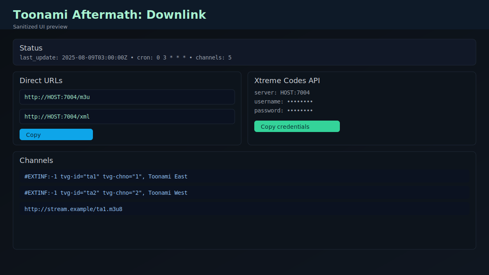
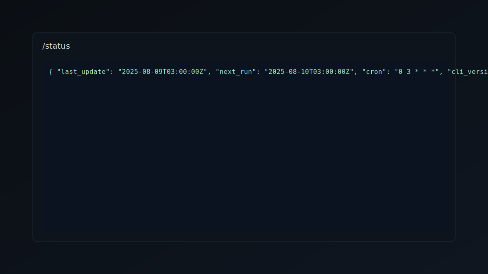

# Toonami Aftermath: Downlink

> *Tapping into the underground broadcast feed*

A lightweight containerized application that fetches Toonami Aftermath channels using `toonamiaftermath-cli`, generates up-to-date M3U and XMLTV files, and serves them via a Toonami-themed WebUI.

## Screenshots

> The screenshots below are sanitized to avoid any credentials or sensitive info.





## Features

- 🌙 **Dark Toonami Theme** - Sleek futuristic UI with glowing accents
- 📺 **Auto-Updated Feeds** - Daily updates via configurable cron schedule  
- 🚀 **Lightweight & Fast** - Alpine-based container (~80MB) with optimized performance
- 🔄 **IPTV Compatible** - Works with Threadfin, Plex, Jellyfin, TiviMate, IPTV Smarters
- 📊 **Live Status** - Real-time channel list and update monitoring
- 🔧 **Simple API** - REST endpoints for M3U, XMLTV, and channel data
- 🔐 **Xtreme Codes API** - Full compatibility with IPTV players using Xtreme Codes protocol
- 🎫 **Auto-Generated Credentials** - Unique username/password created on first run
- ♿ **Accessibility** - WCAG AA compliant with keyboard navigation and screen reader support
- 📱 **Mobile Friendly** - Responsive design optimized for touch devices
- 🛡️ **Secure & Reliable** - Input validation, structured logging, comprehensive error handling
- ⚡ **Performance Optimized** - Caching, compression, and resource optimization

## Performance Highlights

- **20-30% smaller** response sizes via GZip compression
- **60-second caching** for channel data reduces I/O overhead  
- **Preloaded resources** for faster page loading
- **Optimized Docker builds** with better layer caching
- **Health monitoring** with comprehensive diagnostic endpoints

## Quick start (Docker)

```pwsh
# Build
docker build -t toonami-downlink:latest .

# Run
docker run -d --name toonami-downlink -p 7004:7004 -v /mnt/user/appdata/toonami-downlink:/data -e CRON_SCHEDULE="0 3 * * *" --restart unless-stopped toonami-downlink:latest
```

Open <http://localhost:7004> to access the WebUI. The server will generate files at startup and then on the schedule.

## docker-compose

```yaml
version: "3.8"
services:
  toonami-downlink:
    image: toonami-downlink:latest
    container_name: toonami-downlink
    ports:
      - "7004:7004"
    volumes:
      - /mnt/user/appdata/toonami-downlink:/data
    environment:
      - CRON_SCHEDULE=0 3 * * *
    restart: unless-stopped
```

## Integrations

### Xtreme Codes API (Recommended)

Most modern IPTV players support Xtreme Codes API. Configure your player with:

- **Server URL**: `your-server-ip:7004` (without http://)
- **Username**: Auto-generated (visible in WebUI)
- **Password**: Auto-generated (visible in WebUI)

Compatible with: TiviMate, IPTV Smarters, Perfect Player, GSE Smart IPTV, and more.

### Direct M3U/XMLTV

For players that don't support Xtreme Codes:

- **M3U Playlist**: `http://HOST:7004/m3u`
- **M3U w/ Stream Codes**: `http://HOST:7004/m3u/stream-codes/YOUR_CODE`
- **XMLTV EPG**: `http://HOST:7004/xml`

### API Endpoints

- `/player_api.php` - Xtreme Codes API endpoint
- `/get.php` - Xtreme Codes M3U endpoint
- `/xmltv.php` - Xtreme Codes EPG endpoint
- `/live/{username}/{password}/{stream_id}.ts` - Stream redirect
- `/credentials` - Get your unique credentials

### FFmpeg transcoder reference

```text
-hide_banner -loglevel info -reconnect 1 -reconnect_streamed 1 -reconnect_delay_max 5 -rw_timeout 8000000 -analyzeduration 1M -probesize 1M -i [URL] -vf scale=trunc(iw/2)*2:trunc(ih/2)*2,format=yuv420p -c:v h264_nvenc -preset p4 -b:v 4M -maxrate 5M -bufsize 8M -g 60 -keyint_min 60 -rc vbr_hq -bf 0 -c:a ac3 -ar 48000 -ac 2 -b:a 192k -af aresample=async=1:first_pts=0 -f mpegts -mpegts_flags +resend_headers -flush_packets 1 -muxpreload 0 -muxdelay 0 pipe:1
```

## Unraid Community Apps

- Map `/data` to `/mnt/user/appdata/toonami-downlink`
- Expose port 7004
- Set `CRON_SCHEDULE` (UTC) as desired, e.g., `0 3 * * *`
- Use `unraid/template.xml` in your template repo. Icon: `web/assets/favicon.svg`.

## Configuration

Environment variables:

- `CRON_SCHEDULE`: cron expression for updates (minute hour dom month dow). Example: `0 3 * * *` (3 AM UTC daily)
- `PORT`: HTTP port (default `7004`)
- `DATA_DIR`: where to write `index.m3u` and `index.xml` (default `/data`)

## Development

### Quick Setup

```bash
# Clone repository
git clone https://github.com/zachyzissou/toonamiaftermath-downlink.git
cd toonamiaftermath-downlink

# Set up Python environment
python -m venv venv
source venv/bin/activate  # On Windows: venv\Scripts\activate
pip install -r requirements.txt

# Install Node.js dependencies (for linting/formatting)
npm install

# Run development server
npm run dev
# or
python run_dev.py
```

### Code Quality Tools

```bash
# Run all linting
npm run lint

# Auto-fix formatting
npm run format  

# Run tests
npm test
```

### Docker Development

```bash
# Build and test locally
docker build -t toonami-downlink:dev .
docker run -p 7004:7004 -v $(pwd)/data:/data toonami-downlink:dev

# Test health endpoint
curl http://localhost:7004/health
```

### Contributing

See [CONTRIBUTING.md](CONTRIBUTING.md) for detailed development guidelines, coding standards, and contribution workflow.

### Performance Testing

The application includes performance optimizations and monitoring:

- **Caching**: 60-second TTL for channel data
- **Compression**: GZip middleware for response optimization  
- **Health monitoring**: `/health` endpoint for container orchestration
- **Structured logging**: Comprehensive diagnostic information

### Troubleshooting

For common issues and debugging help, see [TROUBLESHOOTING.md](TROUBLESHOOTING.md).

## Security & Authentication

### Zero-Configuration Setup

- **Automatic credential generation** - Unique Xtreme Codes username/password created on first launch
- **Persistent credentials** - Stored in `/data/credentials.json` and retained across restarts  
- **Easy access** - View credentials in WebUI or at `/credentials` endpoint
- **IPTV player guides** - Step-by-step setup instructions for popular players included

### Stream Code Support

If your Toonami Aftermath streams require authentication codes, use the stream code endpoint:

- Standard M3U: `/m3u`
- With stream codes: `/m3u/stream-codes/YOUR_CODE`

No configuration needed - both endpoints are always available.

## Credits

See [CREDITS.md](CREDITS.md) for full attribution and dependencies.

## License

MIT License - See [LICENSE](LICENSE) file

## Notes

- The image bundles the toonamiaftermath-cli v1.1.1 binary by chris102994
- Files are generated on startup and then according to the cron schedule
- The WebUI auto-refreshes status every 30 seconds
- Not affiliated with Toonami, Adult Swim, or Warner Bros. Discovery
